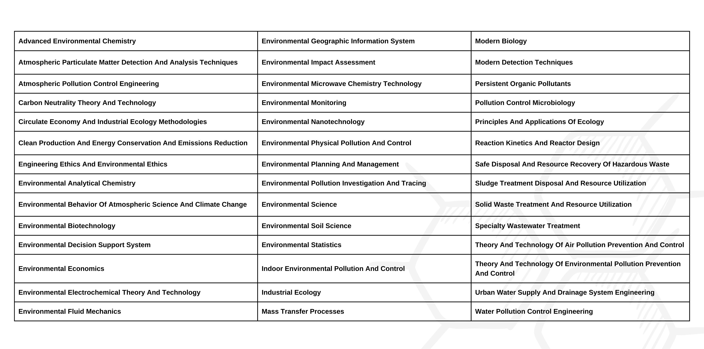
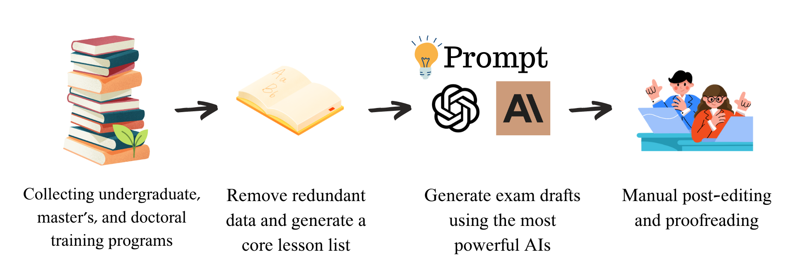

## Dataset Summary
EnviroExam focuses on 42 core courses from the environmental science curriculum at Harbin Institute of Technology, after excluding general, duplicate, and practical courses from a total of 141 courses across undergraduate, master's, and doctoral programs. 
For these 42 courses, initial draft questions were generated using GPT-4 and Claude, combined with customized prompts. These drafts were then refined and proofread manually, resulting in a total of 1,290 multiple-choice questions. 
After final proofreading and refinement, 936 valid questions remained.

Core Courses in Environmental Science Covered: The following are the environmental science education plan and number of questions for the 42 core classes.

## Core Courses in Environmental Science Covered
The following are the environmental science education plan and number of questions for the 42 core classes.


## Data Collection and Process workflows: 


## Scoring Method

EnviroExam uses accuracy as the basis for scoring each subject's questions and employs a comprehensive metric when calculating the total score. The formula derivation process is as follows:

1. **Calculation of the average score \( M \)**: For each large language model, compute the arithmetic mean of all its test scores (accuracy):

    \[
    M = \frac{1}{n} \sum_{i=1}^{n} s_i
    \]

    Where \( s_i \) is the score of a large language model on a specific test, and \( n \) is the total number of tests.

2. **Calculate the standard deviation**: Compute the standard deviation of all test scores relative to the mean:

    \[
    \sigma = \sqrt{\frac{1}{n} \sum_{i=1}^{n} (s_i - 1)^2}
    \]

3. **Calculate the coefficient of variation (CV)**: The coefficient of variation is the ratio of the standard deviation to the mean and is used to measure the relative dispersion of the scores:

    \[
    \text{CV} = \frac{\sigma}{M}
    \]

4. **Calculate the original composite index \( I \)**: The original composite index \( I \) is defined as a function of the mean score and the coefficient of variation:

    \[
    I = 
    \left\{
    \begin{array}{ll}
    M \times (1 - \text{CV}), & 0 \leq \text{CV} \leq 1 \\
    \text{model void}^*, & \text{CV} > 1
    \end{array}
    \right.
    \]

\* When CV is greater than 1, it indicates that the relative variability of the data is very high, and the mean can no longer effectively represent the central tendency of the data [source](https://www.frontiersin.org/articles/10.3389/fams.2019.00043/full).


[//]: # (## News)

[//]: # (* **[2024.05.22]** EnviroExam has been accepted to ArXiv 🎉🎉🎉)


## Leaderboard

Below are zero-shot and five-shot accuracies from the models that we evaluate in the initial release, please visit our official [Leaderboard](https://enviroexam.enviroscientist.cn) for up-to-date models and their detailed results on each subject. 

#### Zero-shot
| Dataset                    | Mean   | σ     | cv   | 1-cv | M*(1-cv) |
|----------------------------|--------|-------|------|------|----------|
| baichuan2-13b-chat         | 83.63  | 10.39 | 0.12 | 0.88 | 73.24    |
| baichuan-13b-chat          | 78.97  | 11.89 | 0.15 | 0.85 | 67.08    |
| chatglm2-6b                | 62.65  | 16.67 | 0.27 | 0.73 | 45.98    |
| chatglm3-6b                | 75.80  | 13.13 | 0.17 | 0.83 | 62.68    |
| chatglm3-6b-32k            | 81.97  | 12.76 | 0.16 | 0.84 | 69.21    |
| deepseek-7b-chat           | 52.77  | 16.59 | 0.31 | 0.69 | 36.18    |
| deepseek-67b-chat          | 62.83  | 19.66 | 0.31 | 0.69 | 43.17    |
| gemma-7b                   | 74.35  | 14.91 | 0.20 | 0.80 | 59.44    |
| gemma-2b-it                | 63.02  | 15.73 | 0.25 | 0.75 | 47.29    |
| internlm2-chat-20b         | 80.80  | 14.08 | 0.17 | 0.83 | 66.72    |
| internlm2-chat-7b          | 85.88  | 12.36 | 0.14 | 0.86 | 73.52    |
| internlm-chat-20b          | 83.43  | 14.05 | 0.17 | 0.83 | 69.37    |
| internlm-chat-7b           | 80.58  | 13.24 | 0.16 | 0.84 | 67.34    |
| mistral-7b-instruct-v0.1   | 64.78  | 17.61 | 0.27 | 0.73 | 47.17    |
| mixtral-8x7b-instruct-v0.1 | 82.24  | 11.75 | 0.14 | 0.86 | 70.48    |
| qwen1.5-14b-chat           | 83.86  | 13.20 | 0.16 | 0.84 | 70.66    |
| qwen1.5-7b-chat            | 80.96  | 15.88 | 0.20 | 0.80 | 65.08    |
| qwen-14b-chat              | 80.56  | 15.20 | 0.19 | 0.81 | 65.35    |
| qwen-7b-chat               | 65.95  | 15.75 | 0.24 | 0.76 | 50.20    |
| vicuna-13b-v1.5            | 34.49  | 17.53 | 0.51 | 0.49 | 16.96    |
| vicuna-7b-v1.5             | 33.21  | 17.80 | 0.54 | 0.46 | 15.41    |
| vicuna-7b-v1.5-16k         | 56.51  | 15.14 | 0.27 | 0.73 | 41.37    |
| bluelm-7b-chat             | 81.35  | 13.29 | 0.16 | 0.84 | 68.07    |
| tigerbot-13b-chat-v2       | 74.30  | 15.13 | 0.20 | 0.80 | 59.17    |
| tigerbot-7b-chat-v3        | 68.03  | 16.85 | 0.25 | 0.75 | 51.17    |
| llama-3-8b-instruct        | 66.99  | 22.20 | 0.33 | 0.67 | 44.79    |
| llama-3-70b-instruct       | 89.59  | 9.11  | 0.10 | 0.90 | 80.47    |
| llama-2-70b-chat           | 59.17  | 15.81 | 0.27 | 0.73 | 43.35    |
| llama-2-13b-chat           | 37.40  | 18.88 | 0.50 | 0.50 | 18.52    |
| skywork-13b                | 35.73  | 17.97 | 0.50 | 0.50 | 17.75    |
| yi-6b-chat                 | 82.94  | 11.99 | 0.14 | 0.86 | 70.95    |

#### Five-shot
| Dataset                    | Mean   | σ     | cv   | 1-cv | M*(1-cv) |
|----------------------------|--------|-------|------|------|----------|
| baichuan2-13b-chat         | 83.63  | 10.39 | 0.12 | 0.88 | 73.24    |
| baichuan-13b-chat          | 78.97  | 11.89 | 0.15 | 0.85 | 67.08    |
| chatglm2-6b                | 62.65  | 16.67 | 0.27 | 0.73 | 45.98    |
| chatglm3-6b                | 75.80  | 13.13 | 0.17 | 0.83 | 62.68    |
| chatglm3-6b-32k            | 81.97  | 12.76 | 0.16 | 0.84 | 69.21    |
| deepseek-7b-chat           | 52.77  | 16.59 | 0.31 | 0.69 | 36.18    |
| deepseek-67b-chat          | 62.83  | 19.66 | 0.31 | 0.69 | 43.17    |
| gemma-7b                   | 74.35  | 14.91 | 0.20 | 0.80 | 59.44    |
| gemma-2b-it                | 63.02  | 15.73 | 0.25 | 0.75 | 47.29    |
| internlm2-chat-20b         | 80.80  | 14.08 | 0.17 | 0.83 | 66.72    |
| internlm2-chat-7b          | 85.88  | 12.36 | 0.14 | 0.86 | 73.52    |
| internlm-chat-20b          | 83.43  | 14.05 | 0.17 | 0.83 | 69.37    |
| internlm-chat-7b           | 80.58  | 13.24 | 0.16 | 0.84 | 67.34    |
| mistral-7b-instruct-v0.1   | 64.78  | 17.61 | 0.27 | 0.73 | 47.17    |
| mixtral-8x7b-instruct-v0.1 | 82.24  | 11.75 | 0.14 | 0.86 | 70.48    |
| qwen1.5-14b-chat           | 83.86  | 13.20 | 0.16 | 0.84 | 70.66    |
| qwen1.5-7b-chat            | 80.96  | 15.88 | 0.20 | 0.80 | 65.08    |
| qwen-14b-chat              | 80.56  | 15.20 | 0.19 | 0.81 | 65.35    |
| qwen-7b-chat               | 65.95  | 15.75 | 0.24 | 0.76 | 50.20    |
| vicuna-13b-v1.5            | 34.49  | 17.53 | 0.51 | 0.49 | 16.96    |
| vicuna-7b-v1.5             | 33.21  | 17.80 | 0.54 | 0.46 | 15.41    |
| vicuna-7b-v1.5-16k         | 56.51  | 15.14 | 0.27 | 0.73 | 41.37    |
| bluelm-7b-chat             | 81.35  | 13.29 | 0.16 | 0.84 | 68.07    |
| tigerbot-13b-chat-v2       | 74.30  | 15.13 | 0.20 | 0.80 | 59.17    |
| tigerbot-7b-chat-v3        | 68.03  | 16.85 | 0.25 | 0.75 | 51.17    |
| llama-3-8b-instruct        | 66.99  | 22.20 | 0.33 | 0.67 | 44.79    |
| llama-3-70b-instruct       | 89.59  | 9.11  | 0.10 | 0.90 | 80.47    |
| llama-2-70b-chat           | 59.17  | 15.81 | 0.27 | 0.73 | 43.35    |
| llama-2-13b-chat           | 37.40  | 18.88 | 0.50 | 0.50 | 18.52    |
| skywork-13b                | 35.73  | 17.97 | 0.50 | 0.50 | 17.75    |
| yi-6b-chat                 | 82.94  | 11.99 | 0.14 | 0.86 | 70.95    |


## Data

#### Download

- Download the zip file (you can also simply open the following link with the browser):
  ```
  git clone https://huggingface.co/datasets/enviroscientist/EnviroExam
  ```


#### Notes

Below is a dev example from environmental geographic information system:

```
id: 1
question:What is the purpose of using "spatial interpolation" in GIS?
A: Fill in the blank areas in geographic data
B: Improve the resolution of the map
C: Connect different GIS systems
D: Generate a three-dimensional terrain map
answer: A
 ```


## How to Evaluate EnviroExam on OpenCompass
1. For detailed installation steps, please refer to the official [OpenCompass](https://github.com/open-compass/opencompass) documentation. However, the general installation method is as follows:
```bash
conda create --name opencompass python=3.10 pytorch torchvision pytorch-cuda -c nvidia -c pytorch -y
conda activate opencompass
git clone https://github.com/open-compass/opencompass opencompass
cd opencompass
pip install -e .
```
2. Since OpenCompass has not yet included EnviroExam in the default test sets, it needs to be added manually.


## TODO

- [x] add zero-shot results


## Licenses

[](https://lbesson.mit-license.org/)

This work is licensed under a [MIT License](https://lbesson.mit-license.org/).

## Citation

Please cite our paper if you use our dataset.
```
@misc{huang2024enviroexam,
      title={EnviroExam: Benchmarking Environmental Science Knowledge of Large Language Models}, 
      author={Yu Huang and Liang Guo and Wanqian Guo and Zhe Tao and Yang Lv and Zhihao Sun and Dongfang Zhao},
      year={2024},
      eprint={2405.11265},
      archivePrefix={arXiv},
      primaryClass={cs.CL}
}
```